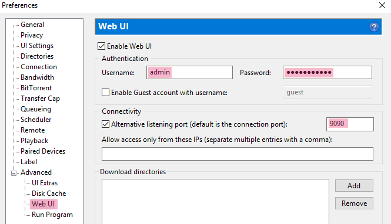
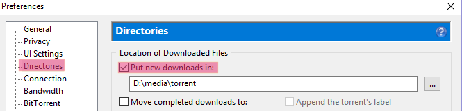
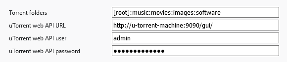

# Add torrent

[Firefox Add-On](https://github.com/GChristensen/torrent-add/releases/download/v0.1.0.4/add_torrent.xpi)
:: 
[Chrome Extension](https://chrome.google.com/webstore/detail/add-torrent/ebigbooofepkiinneomglffcehbmjdel)
 
`--------------------------------------------------------------------`

`--------------------------------------------------------------------`

Allows to instantly begin download of a torrent or magnet link into a configurable set of
directories in uTorrent. Very useful, if you have uTorrent on a dedicated machine.

There is a couple of setting should be configured:
* uTorrent: 'Advanced' | 'Webu UI' | 'Enable Web UI' 

* uTorrent: 'Directories' | 'Put new downloads in' (the files will be downloaded into the corresponding
 subdirectories of this folder): 

* You also need to provide uTorrent API url, username and password in the addon settings: 

WARNING!: in some rare cases torrent links will not be added due to Firefox restrictions. 